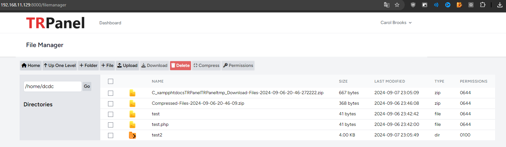

## Neden?
Çünkü linux komutlarından nefret ediyorum ve benim gibi nefret edenler vardır. Ve Cpanel artık dolar kuru ile çok pahalı. 

## Proje Tamamlanır mı?
En azından dosya yöneticisi bölümü tamamlanır. 

## Kurulum
```sudo rm -rf /tmp/lamp.sh && sudo wget -O /tmp/lamp.sh https://raw.githubusercontent.com/duran004/TRPanel/main/lamp.sh && sudo chmod +x /tmp/lamp.sh && sudo /tmp/lamp.sh```


### BETA VERSİONDUR!
